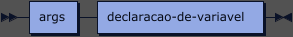
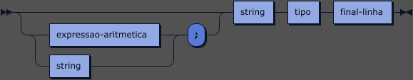
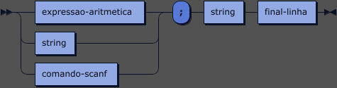
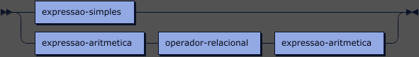
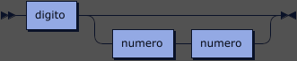
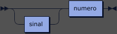
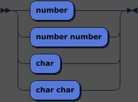
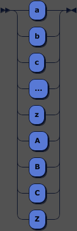
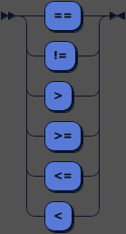
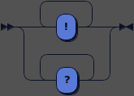

# Notação EBNF


##
# Diagramas Da Notação EBNF
**bloco-função**


```
bloco-função
         ::= bloco-comandos ( '}' args '{' )? string
```

**args:**



```
args     ::= args declaracao-de-variavel
```

referenced by:

* args
* bloco-função

**bloco-comandos:**


```
bloco-comandos
         ::= '}' comando+ '{'
```

referenced by:

* bloco-função
* comando-for
* comando-iff
* comando-while

**comando:**


```
comando  ::= comando-printf
           | comando-scanf
           | comando-iff
           | comando-for
           | comando-while
           | declaracao-de-variavel
           | atribuicao-de-variavel
```

referenced by:

* bloco-comandos

**comando-printf:**


```
comando-printf
         ::= ')' string '(' printf final-linha
```

referenced by:

* comando

**comando-scanf:**


```
comando-scanf
         ::= ')' '(' scanf final-linha
```

referenced by:

* atribuicao-de-variavel
* comando

**comando-iff:**


```
comando-iff
         ::= ')' expressao-booleana '(' iff final-linha bloco-comandos ( else final-linha bloco-comandos )?
```

referenced by:

* comando

**comando-for:**


```
comando-for
         ::= ')' declaracao-de-variavel? expressao-booleana final-linha atribuicao-de-variavel '(' for final-linha bloco-comandos
```

referenced by:

* comando

**comando-while:**


```
comando-while
         ::= ')' expressao-booleana '(' while final-linha bloco-comandos
```

referenced by:

* comando

**declaracao-de-variavel:**



```
declaracao-de-variavel
         ::= ( ( expressao-aritmetica | string ) ';' )? string tipo final-linha
```

referenced by:

* args
* comando
* comando-for

**atribuicao-de-variavel:**



```
atribuicao-de-variavel
         ::= ( expressao-aritmetica | string | comando-scanf ) ';' string final-linha
```

referenced by:

* comando
* comando-for

**expressao-aritmetica:**


```
expressao-aritmetica
         ::= expressao-simples
           | expressao-aritmetica operador-aritmetico expressao-aritmetica
```

referenced by:

* atribuicao-de-variavel
* declaracao-de-variavel
* expressao-aritmetica
* expressao-booleana

**expressao-simples:**


```
expressao-simples
         ::= numero
           | string
```

referenced by:

* expressao-aritmetica
* expressao-booleana

**expressao-booleana:**



```
expressao-booleana
         ::= expressao-simples
           | expressao-aritmetica operador-relacional expressao-aritmetica
```

referenced by:

* comando-for
* comando-iff
* comando-while

**string:**


```
string   ::= letra ( letra | digito )*
```

referenced by:

* atribuicao-de-variavel
* bloco-função
* comando-printf
* declaracao-de-variavel
* expressao-simples

**numero:**



```
numero   ::= digito ( numero numero )?
```

referenced by:

* expressao-simples
* inteiro
* numero
* real

**real:**


```
real     ::= sinal? numero . numero numero
```

**inteiro:**



```
inteiro  ::= sinal? numero
```

**tipo:**



```
tipo     ::= 'number'
           | 'number number'
           | 'char'
           | 'char char'
```

referenced by:

* declaracao-de-variavel

**letra:**



```
letra    ::= 'a'
           | 'b'
           | 'c'
           | '...'
           | 'z'
           | 'A '
           | 'B'
           | 'C'
           | 'Z'
```

referenced by:

* string

**operador-relacional:**



```
operador-relacional
         ::= '=='
           | '!='
           | '>'
           | '>='
           | '<='
           | '<'
```

referenced by:

* expressao-booleana

**operador-aritmetico:**


```
operador-aritmetico
         ::= '+'
           | '-'
           | '*'
           | '/'
           | '%'
```

referenced by:

* expressao-aritmetica

**digito:**


```
digito   ::= '0'
           | '1'
           | '...'
           | '9'
```

referenced by:

* numero
* string

**sinal:**


```
sinal    ::= '+'
           | '-'
```

referenced by:

* inteiro
* real

**final-linha:**



```
final-linha
         ::= '!'+
           | '?'+
```

referenced by:

* atribuicao-de-variavel
* comando-for
* comando-iff
* comando-printf
* comando-scanf
* comando-while
* declaracao-de-variavel

